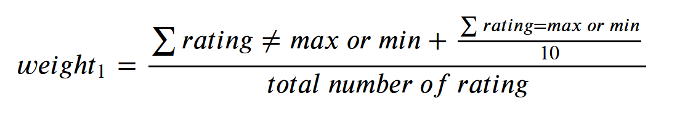
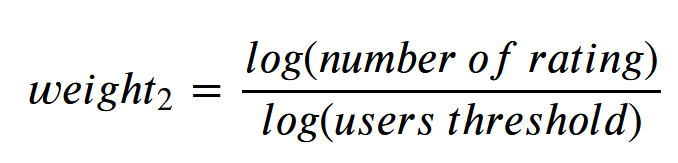
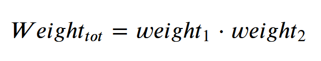

It is not impetuous to say that during his lifetime, the majority of human beings on earth will have tasted the cold and sweet beverage that is called beer. Some may dislike it, some may love it a little bit too much, but the least to say is that everybody has some word about it. 

Indeed, not only this drink is universal, but it's also widely diverse in taste, style, ingredients, .... A real spectrum of variety across the different cultures of the world. Of course, with today mondialisation, every style is not confined to its region of origin anymore, it had the chance to spread across borders and oceans. That let people around the globe able to enjoy any kind they want.

This variety opened an endless debate : what is the best beer? The answer will always be impossible to find, as objectivity does not have its place here : the opinion of someone is greatly biaised by its taste, country of birth, social condition,... . Trying to make your voice heard may make tones and emotions rise and lead to severe tensions, which is the opposite of the desired atmosphere when filling the glasses.

However, another question can be answered : what is the prefered beer of all? Moreover, can people with very different origins find common ground around a full to the brim pint?

## Goal
What if we re-arranged the world through beer taste? What would be the map resulting from it? What countries will be linked per their beer’s love? Can natural enemies become friends over a nice cold beverage? 

This project will have two phases: the first will be to find the good method to compute the favorite beer style per country. Next, we will cluster the different country to see what region will result from it.

## 1. What is the favorite beer per country?

First of all let's talk about the data used for our analysis.

All come from the american website [RateBeer](https://www.ratebeer.com/), which is, according to it : *widely recognized as the most in-depth, accurate, and one of the most-visited source for beer information. RateBeer is a world site for craft beer enthusiasts and is dedicated to serving the entire craft beer community through beer education, promotion and outreach. RateBeeris a consumer-driven Web site and we strive to remain unbiased in our ratings and editorial content.*

On this website, users can rate beers on 4 aspects : appearance, aroma, palate and taste, and they can add a text review to comment their opinion. Each user can encode its country (assuming that they entered their real one), which will be very useful here, and write as many ratings as he likes:

 

### Cut the weeds

As we can see, a large number of users only leave one or very few ratings. As our purpose is to compute the prefered style for the users, the ones that leave almost no ratings are of very litte help to achieve it. So, as well as the website methods to compute the average score of a beer ([RateBeer Quality assurance](https://www.ratebeer.com/ratingsqa.asp)), we will need to take out users under a certain threshold of ratings.

Moreover, the same reasonning can be applied for the countries : if we do not have enough users for a certain country, does it make sens to compute its favorite style? Will it really be representative of its population?

Unfortunately we cannot only look at the precision and correctness of our result : indeed, what is the point of having expert users and countries with thousands of reviewers if we end up with 2 countries only? We had to make a compromise between plentiness and data quality: 

 

Our choice is to keep users with at least 8 ratings, and country with at least 10 users.

Let's look at the remaining countries :



Without surprise, we see that the main place represented is Nothern America with the USA, home country of the website. Next we have Europe in second place, with each cardinal points more or less equal in number of users.

### Is it a democraty?

The answer is no. Not every user worth the same in term of opinion : we already took out the ones without a sufficient rating history. In addition, some users can have binary ratings (0 or 20) to favor their opinion in the overall site rating. Also, we could see the opinion of expert (people with a lot of ratings), more representatif than some amateur. So we decided to apply a weight to all users, in the order to try to be as accurate as possible.

\

    Warning :

    This section will contain math. If the reader has mathophobia, please skip this section. Reader discretion is advised

2 factors need to be taken into account : 

1. **Binarity** : The factor is always between 0.1 and 1. The factor 10 is arbitrary, but help to reduce the influence of those users while still keeping their rating into account, and avoid sparcity of the data.

2. **expertise** : This factor is equal to 1 at the minimum, and increase with the number of review.

The final weight will be the product of those 2 weigths.

    End of math

At the end, we see the repartition of the different users, with a spike around 1 : a grand proportion does not have a great number of ratings, but still are not binary reviewers.





### Old beer lovers
These data were collected at the Beer Rate site during the period 2001 to 2017. We notice a large increase of number of ratings per year over time! Especially in the first half of its life. In the second half, there is still a steady and constant increase of ratings. As you know, the popularity of the internet continues to grow and therefore it is not surprising to see an increase in reviews over the years. It is also worth mentioning that Rate Beer is a website and at the beginning it is not easy to get users to review beers. These two factors explain why there has been an increase in users over the years. It is even noticeable that this site had a linear growth. 

However, in 2018 there has been a decrease in reviews, but this is completely logical as the data for the site was collected in the middle of the year. For this reason we will carry out our analysis up to 2017.
 

### Touring each country's favourites

The table of the three best beers per country shows surprisingly that there is no strong relationship between the taste of beers and continents or sub-regions. Among all European countries, it is interesting to note that some neighbouring countries have completely different tastes. But places that are both geographically distant and culturally distant (e.g. Russia and Canada) share a similar taste. On all continents and in all sub-regions, almost all European countries have colours, which means that they have collected enough data, which is consistent with our impression that Europeans are generally big beer enjoyers. However, the countries of the Middle East, South-East Asia and Africa are not represented, which may be partly explained by their history and religion.



Knowing that the number of reviews is not equitable over time, we analyse the beer styles that each region in the world prefers over the different periods. The periods are computed by dividing the timespan of the data between the number of periods we want to analyze. Based on this, it is possible to find out which style comes up most often over the different time periods and is therefore the user's favourite style for each region.

Despite the multitude of different beer styles, it can be seen that all regions are convinced of imperial stout beers, which are almost in the top three for each region over the whole period. Furthermore, it can be seen that each culture has its own typical taste, such as India Style Lager which is in second place in Eastern Asia or Speciality Grain which is in first place in Oceania.

Moreover, we notice that there have been trends that have spread over the years. Let's analyse the imperial stout. At the beginning it was the preferred beer style of people in North America and Northern Europe. A few years later it was the preferred style for those in South America. And this trend continued for the third period, during which imperial stout was in first place in Africa, Western Europe and Oceania. In the fourth period it was in Saudi Arabia where Imperial Stout was in first position. And finally in the fifth period we finish the tour as it was again in first position in North America. There was an influence of beer from north to south and from west to east during the period. It is noticeable that after 17 years the same trends are coming back in North America. Knowing this trend, would it be possible to predict the next beer styles that beer users will love? 



## 2. Redrawing borders using beer preferences

What if we do not only look at the Top 3 of favorite styles per location, but take into account the all spectrum of opinion over all styles to reunite people around the globe?

We hypothesize that people aren't so different after all.

If we break down preferences for beer styles into just two axes, we can easily visualize similarities between different countries's preferences for beers. Not every country has rated every type of beer style, so we used item-based collaborative filtering to fill in the gaps.

The results, after decomposing high-dimension preference vectors into two axes is a map, where the size of the bubbles indicate the size of the country.

<iframe width="1000" height="666" src="https://datastudio.google.com/embed/reporting/e19fe6eb-0b94-4976-ac9f-4a45fa8dde40/page/218AD" frameborder="0" style="border:0" allowfullscreen></iframe>

It seems rather fitting that Tanzania, Kazakhstan and Namibia are some of the outliers in this graph. To be honest, we're not familiar with the beers that these countries enjoy, and perhaps it goes to show that you really need to travel to unorthodox parts of the world to experience tastes that are truly different.

However, it can be slightly difficult to visualize patterns from a set of axes which we're unfamiliar with. Hence, we decided to draw out similarities by clustering countries based on these vectors and coloring these clusters on a map of the world. In this way, we can really redraw the borders of the world.

The resulting world map is plotted below.

<iframe width="1000" height="333" src="https://datastudio.google.com/embed/reporting/e19fe6eb-0b94-4976-ac9f-4a45fa8dde40/page/p_l0bphrvq1c" frameborder="0" style="border:0" allowfullscreen></iframe>

Surprisingly, beer preferences are much less region specific. While Argentina, Chile, Brazil and Uruguay sharing the similar beer preferences may not shock anyone, who would have thought Russia, Ukraine and the United States would share similar preferences? Does the past cultural wars made paradoxally their taste more similar? Or let alone Canada and China?

We notice that particularly in Europe, countries like Croatia and Slovenia can share political borders with many countries, and yet differ with all of their neighbours in terms of beer preferences. Europe is known to produce a large variety of beers, so this might not come as a surprise to many. Also we need to keep in mind the fact that the number of users may not be representative of they're country average taste.

# Conclusion

Wrapping up, our biggest takeaway has got to be that we've got to start putting away our inhibitions when meeting people and cultures we're unfamiliar with. For all you know, they might just happen to share the most similar preferences with you, be it for beer, or other drinks, or for anything else in life.

In a world where we can sometimes feel like there is so much tension and disagreements out there, it's truly comforting to know that preferences for beers aren't exactly localized - just because countries are halfway across the globe from each other, it really doesn't mean that you can't share in the same enjoyment of sipping down a warm, frothy mug of beer.

Trends exist all over the world. And this is also true for beers such as the imperial stout style, which over the years has been the preferred beer style on different continents with a trend from North to South and from West to East.

However, we shall stay critical over those results : a lot of assumptions has been made, and the poor number of users and ratings for certain aeras made the conclusion touchy. Indeed, the website stays of american origin, and the sole fact that it is mainly written in english already excludes a lot of the world population to access it (and even more the fact that you need an access to internet too).

Nevertheless, the idea that people with drastically different lifes and cultures could still sit together and enjoy this intemporal beverage put a smile on our faces, and we hope on yours too :).
